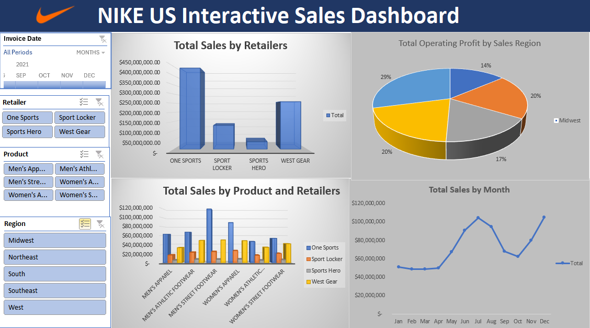
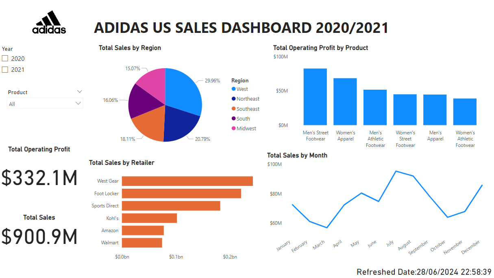

# Data Analytics Portfolio
# Project 1
**Title:** [Nike US Sales Dashboard](https://github.com/Buchimaife/Buchimaife.github.io/blob/main/NIKE%20DASHBOARDAdvanced-Pivot-Start_v2.xlsx)

**Tools Used:** Microsoft Excel 365 (Conditional formatting, Power query Editor, Pivot table, Pivot chart, Slicers, Time lines)

**Description:** 
The project was carried out to analyze the sales data of Nike USA to identify trends and patterns in the company's sales performance. This project delves into the monthly performance analysis of NIKE USA using it’s sales data from 2021. The data shows the company operates with four  retailers ( One Sports, Sports Locker, Sports Hero and West Gear) , selling 6 products (Men’s Apparel, Men’s Athletic Footwear,  Men’s Street Footwear, Women’s Apparel, Women’s Athletic Footwear and Women’s Street Footwear ) across 50 states and 5 regions in United states of America.
The primary objective of this analysis is to identify the top-selling product by retailers and Operating Profit  within this company across various regions in 2021. This insight has the potential to contribute to better decision making and  the company’s growth in the industry.

Key columns under scrutiny include Retailer, Product, Region, Sales, and Month.

**Key Findings:** 

**Sales by Retailers:** “One Sports” proved to be the retailer with the highest product sales across the 5 regions. This highlights the profitability and a robust sales strategy which “One Sports” brings to the business which encourages business continuity. “Sports Hero” on the other hand proved to have the least product sales across the 5 regions. This is a pointer for a future project to analyze key indexes that negatively affects their sales in order to re-strategize and boost sales or consider business continuity.

**Sales by Product :** “ Men Street Footwear” proved to be the the highest product sales across the 5 regions. This highlights the profitability and a strong preference for this product. “Women Athletic Footwear”  on the other hand proved to have the least purchased product across the regions.

**Operating Profit by Sales:** “West” region proved to be making the most profit by sales across the 5 regions making them prime target customer region.  This highlights "West" profitability .Conversely, “Mid west” made the least of profit by sales across the 5 regions .

**Sales by Months:**  July and November were the sales peak months, showcasing their significance within the sales period.

**Dashboard Overview:**
The dashboard is a visual data representation offering a clear and user-friendly overview of essential insights for specific areas. It’s an interactive display of the presented Key Performance Indicators (KPIs).

# Project 2
**Title:** [Car Sales Dashboard](https://github.com/Buchimaife/Buchimaife.github.io/blob/main/CAR%20SALES%20DASHBOARD.xlsx)

**Tools Used:** Microsoft Excel 365 (Conditional formatting, Power query table, Pivot table, Pivot chart, Slicers, Time lines)

**Description:** This project was carried out to analyse the yearly performance by regions of a Car sales company that sells 3 car segments (Hatchback, Sedan and SUV), using their sales data between 2013 and 2017.
The primary objective of this analysis is to identify the top-selling cars and operating profit within this company across various  Regions, Sales Channels and different segments between the highlighted years. The insights drawn from this analysis  has the potential to contribute to the company’s growth in the industry.

Key columns under scrutiny include Segment, Region, Gross sales, Total revenue, Year, and Sales. 

**Key Findings:** 

**Sales by Segment and Transmission:**  “5 Speed Manual Hatchback” proved to be the top-selling car amongst the 3 car segments. This highlights strong preference for the car across the regions and years under review. Conversely, “6 Speed Manual Sedan”  proved be the least purchased car across the regions.

**Net Sales by Channel:**  Car sales were made through 3 different channel (Dealers, Fleet and Retailers). Amongst the three channels, Sales made through Fleet proved to be the highest. Conversely, sales made through “Dealers” proved to be the least.

**Net Sales by Payment Type:** Payment for the car  were made through 3 different methods ( Cash payment, Financing and leasing). Amongst the three payment methods, most customers made payment through leasing whereas least of the customers made payment through financing. This will inform the company to encourage leasing in order to get in more sales.

**Revenue by Region:**  “North America” proved to have the highest sales revenues across the 3 regions making them prime target customer region.  This highlights North America’s profitability .Conversely, “Europe” has the least revenue by sales across the 3 regions .

**Gross Sales by Year:**  All car segments successfully  recorded sales across the regions  between 2013 and 2017. Notably,  2013 and 2016 were standout years for sales, showcasing their significance within the sales period.

**Dashboard Overview:**
The dashboard is a visual data representation offering a clear and user-friendly overview of essential insights for specific areas. It’s an interactive display of the presented Key Performance Indicators (KPIs).

# Project 3
**Title:** [Adidas US Sales Dashboard 2020/2021](https://github.com/Buchimaife/Buchimaife.github.io/blob/main/Adidas%20Sales%20Power%20Bi%20Dashboard.pbix)

**Tools Used:** Microsoft Power Bi Desktop(Conditional formatting, Charts, Slicers, Cards)

**Description:** The project was carried out to analyze the sales data of Adidas USA to identify trends and patterns in the company's sales performance using their sales data in 2020 and 2021. The data shows the company operates with Six  retailers ( West Gear, Foot Locker, Sports Direct,Kohl's, Amazon and Walmart) , selling 6 products (Men’s Street Footwear, Women’s Apparel, Men’s Athletic Footwear, Women’s Street Footwear, Men’s Apparel, and Women’s Athletic Footwear) across 5 regions in the United states of America.
The primary objective of this analysis is to identify the top-selling product by retailers and Operating Profit within the company across various regions in 2020 and 2021. This insight has the potential to contribute to better decision making and  the company’s growth in the industry.

Key columns under scrutiny include Retailer, Product, Operating Profit, Region, Sales, and Month.

**Key Findings:** 

**Sales by Region:**
“West” of USA  proved to have the highest sales across the 3 regions under review making them prime target customer region.  This highlights the West’s profitability . On the other hand, "Mid west" has the  sales across the 3 regions .

**Operating profit by Product:**
“Men's Street Footwear” proved to have the highest operating profit amongst all six products across the regions. This highlights the profitability and a strong preference for this product. “Women Athletic Footwear”  on the other hand proved to be the least purchased product amongst the 6 products across the regions this signifies low demand for the product.

**Sales by Retailers:**
“West Gear” proved to be the retailer with the highest product sales across the 5 regions. This highlights the profitability and a robust sales strategy which “West Gear” brings to the business which encourages business continuity. “Walmart” on the other hand proved to have the least product sales across the 5 regions. This is a pointer for a future project to analyze key indexes that negatively affects their sales in order to re-strategize and boost sales or consider business continuity.

**Sales by month:**
July appeared to be the average sales peak month between the 2 years in review, showcasing their significance within the sales period.

**Dashboard Overview:**
The dashboard is a visual data representation offering a clear and user-friendly overview of essential insights for specific areas. It’s an interactive display of the presented Key Performance Indicators (KPIs).

# Project 4

**Title:** [WineSales.PNG](https://github.com/Buchimaife/Buchimaife.github.io/blob/main/Adidas%20Sales%20Power%20Bi%20Dashboard.pbix)

**Tools Used:** Microsoft Power Bi Desktop(Conditional formatting, Charts, Slicers, Cards)
**Description:** 
**Key Findings:** 
**Dashboard Overview:**

